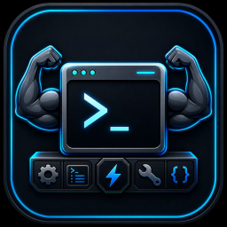

<div align="center">



# ⚡ Super Terminal

**The operating system for AI coding agents.**

*Keep the real terminal. Improve everything around it.*

[](#-download)
[](https://www.electronjs.org/)
[](https://react.dev/)
[](#)

[📥 Download](#-download) · [✨ Features](#-features) · [🚀 One-Command Setup](#-one-command-setup) · [🛠️ Tech Stack](#️-tech-stack) · [🤖 Coding Agents Setup](#-coding-agents-setup)

</div>

---

## 🧠 What is this?

**Super Terminal** is a desktop control center and workspace manager for AI coding agents — Claude Code, Codex CLI, Gemini CLI, OpenCode, CommandCode AI, and any other terminal-based agent.

It doesn't reinvent the terminal. Every agent runs in a real, native PTY (`xterm.js` + `node-pty`) — exactly as if you typed the command yourself. What Super Terminal adds is a dedicated command center: multiple concurrently open projects, custom terminal presets, timeline events detection, automated git conflict resolution, and an onboarding wizard to install your AI companions instantly.

> If it works in a terminal today, it works exactly the same inside Super Terminal.

---

## 🚀 One-Command Setup

To run Super Terminal locally in development mode, clone the repository and run:

```bash
# Installs dependencies, compiles native modules, and launches the app in one go!
pnpm install && pnpm run dev
```

*Prerequisites: Node.js 20+ and pnpm.*

---

## 🤖 Coding Agents Setup Wizard

Getting your AI coding companions ready is easier than ever. On first launch, or via the **New Terminal Session** dialog, the **Coding Agents Setup Wizard** will:
1. Scan your system PATH for installed CLI tools (`claude`, `codex`, `agy`, `commandcode`, `opencode`).
2. Display a checklist of available coding companions.
3. Automatically run a global installation command (e.g. `npm install -g @anthropic-ai/claude-code`) directly in a new terminal tab, allowing you to watch the installation progress live and log in immediately.

---

## ✨ Features

| Category | Description |
|---|---|
| 📂 **Multi-Project Tabs** | Switch between multiple active projects/workspaces instantly with full state restoration (sessions, layout, history). |
| 🤖 **Agent Setup Wizard** | Automatically check which CLI agents are missing on your system and install them with one click. |
| 💻 **Custom Terminal Appearance** | Choose from premium preset themes (Dracula, Nord, Monokai, Solarized, Default), customize font families, font sizes, cursor styles, and cursor blinking. |
| 🌿 **Git Conflict Recovery** | Encountering conflicts during branch checkouts due to untracked files? Super Terminal automatically prompts to move conflicting files aside into a timestamped backup folder and retry the checkout. |
| 🕓 **ANSI-Stripped Timeline** | Captures real-time prompt idles, git commits, and test suite completions by parsing ANSI-stripped terminal streams. |
| 💾 **Workspace Persistence** | Every tab, split layout, file attachment, and terminal session is saved automatically and restored upon app reboot. |

---

## 📦 Production Builds & CI/CD

We use GitHub Actions to automate compiles and installer publishing. 

### Triggering a New Release
Any commit tagged with `v*.*.*` pushed to GitHub triggers the build runner:
```bash
git tag v1.0.2
git push origin v1.0.2
```
A Windows installer (`Super Terminal Setup X.Y.Z.exe`) and portable binary (`SuperTerminal-X.Y.Z-portable.exe`) will be packaged and attached to a new GitHub Release draft automatically.

### Running packaging locally:
```bash
pnpm run build
pnpm run package
```
Builds are saved in the `release/` directory.

---

## 🛠️ Tech Stack

```
Frontend    React · TypeScript · Tailwind CSS · Zustand
Desktop     Electron
Terminal    xterm.js · node-pty
Backend     Local Node.js process · PTY manager · Workspace Restore Engine
```

Everything runs **100% locally**. No cloud dependency, no telemetry phoning home.

---

<div align="center">

**Built for developers who run more than one AI agent and refuse to lose track of any of them.**

</div>
